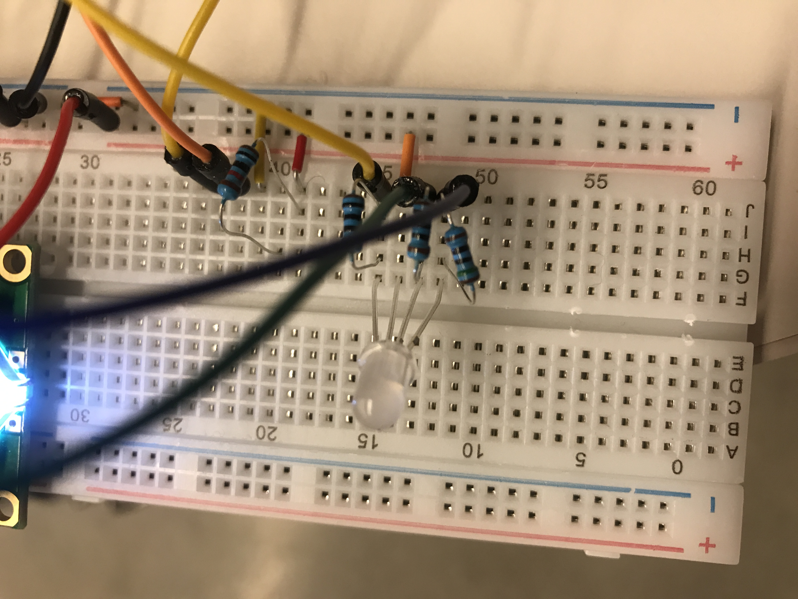

# Data Logger (and using cool sensors!)

*A lab report by Natalie B. Abrams.*

## Part A.  Writing to the Serial Monitor
 
**a. Based on the readings from the serial monitor, what is the range of the analog values being read?**
 
 The range is 0 to 1023
 
**b. How many bits of resolution does the analog to digital converter (ADC) on the Arduino have?**

[RGB color spectrum](./part_b.MOV)

10 bits  (2^10 is 1024). seems like all are being used

## Part B. RGB LED



**How might you use this with only the parts in your kit? Show us your solution.**

By using the Ohm resistors we have in our kit. One for each the blue and green and red. 


## Part C. Voltage Varying Sensors 
 
### 1. FSR, Flex Sensor, Photo cell, Softpot

**a. What voltage values do you see from your force sensor?**

0-1023 (5v)

**b. What kind of relationship does the voltage have as a function of the force applied? (e.g., linear?)**

FSR- seems to be logorithmic. you push lightly and voltage goes up quickly, but you can squeeze really hard
and the voltage levels off. 

Flex Sensor-Linear. as i tilt it with the same consistent force it goes up and down evenly. 

Photo cell-Linear

Softpot-Logorithmic. Very durastic ups and downs.


**c. Can you change the LED fading code values so that you get the full range of output voltages from the LED when using your FSR?**

Yes

```
int fsrAnalogPin = 0; // FSR is connected to analog 0
int redLEDpin = 8;      // connect Red LED to pin 11 (PWM pin)
int blueLEDpin = 10;      // connect Red LED to pin 11 (PWM pin)
int greenLEDpin = 9;      // connect Red LED to pin 11 (PWM pin)
int fsrReading;      // the analog reading from the FSR resistor divider
int redLEDbrightness;
int greenLEDbrightness;
int blueLEDbrightness;
 
void setup(void) {
  Serial.begin(9600);   // We'll send debugging information via the Serial monitor
  pinMode(redLEDpin, OUTPUT);
  pinMode(greenLEDpin, OUTPUT);
  pinMode(blueLEDpin, OUTPUT);
}
 
void loop(void) {
  fsrReading = analogRead(fsrAnalogPin);
  Serial.print("Analog reading = ");
  Serial.println(fsrReading);
 
  // we'll need to change the range from the analog reading (0-1023) down to the range
  // used by analogWrite (0-255) with map!
  redLEDbrightness = map(100,0, 990, 0, fsrReading%100);
  greenLEDbrightness = map(100, 0, 990, fsrReading%100, 255);
  blueLEDbrightness = map(100,fsrReading%100, 990, 0, 255);
  // LED gets brighter the harder you press
  analogWrite(redLEDpin, redLEDbrightness);
  analogWrite(greenLEDpin, greenLEDbrightness);
  analogWrite(blueLEDpin, blueLEDbrightness);
  delay(100);
}

```


**d. What resistance do you need to have in series to get a reasonable range of voltages from each sensor?**


FSR-

Flex Sensor-

Photo Cell- 22k Ohm

Softpot-


**e. What kind of relationship does the resistance have as a function of stimulus? (e.g., linear?)**

FSR- Logorithmic

Flex Sensor- Logorithmic 

Photo Cell- Linear

Softpot- Linear

### 2. Accelerometer

[Accelerometer movement](./accelerometer.mov)
 
**a. Include your accelerometer read-out code in your write-up.**

[Watch it change!](./IMG_1050.TRIM.MOV)

```
// Basic demo for accelerometer readings from Adafruit LIS3DH

#include <Wire.h>
#include <SPI.h>
#include <Adafruit_LIS3DH.h>
#include <Adafruit_Sensor.h>

// Used for software SPI
#define LIS3DH_CLK 13
#define LIS3DH_MISO 12
#define LIS3DH_MOSI 11
// Used for hardware & software SPI
#define LIS3DH_CS 10

// software SPI
//Adafruit_LIS3DH lis = Adafruit_LIS3DH(LIS3DH_CS, LIS3DH_MOSI, LIS3DH_MISO, LIS3DH_CLK);
// hardware SPI
//Adafruit_LIS3DH lis = Adafruit_LIS3DH(LIS3DH_CS);
// I2C
Adafruit_LIS3DH lis = Adafruit_LIS3DH();

#if defined(ARDUINO_ARCH_SAMD)
// for Zero, output on USB Serial console, remove line below if using programming port to program the Zero!
   #define Serial SerialUSB
#endif

int redLEDpin = 10;      // connect Red LED to pin 11 (PWM pin)
int blueLEDpin = 9;      // connect Red LED to pin 11 (PWM pin)
int greenLEDpin = 11;      // connect Red LED to pin 11 (PWM pin)
int red;
int green;
int blue;

void setup(void) {
  pinMode(redLEDpin, OUTPUT);
  pinMode(greenLEDpin, OUTPUT);
  pinMode(blueLEDpin, OUTPUT);
  
#ifndef ESP8266
  while (!Serial);     // will pause Zero, Leonardo, etc until serial console opens
#endif

  Serial.begin(9600);
  Serial.println("LIS3DH test!");
  
  if (! lis.begin(0x18)) {   // change this to 0x19 for alternative i2c address
    Serial.println("Couldnt start");
    while (1);
  }
  Serial.println("LIS3DH found!");
  
  lis.setRange(LIS3DH_RANGE_4_G);   // 2, 4, 8 or 16 G!
  
  Serial.print("Range = "); Serial.print(2 << lis.getRange());  
  Serial.println("G");
}

void loop() {
  lis.read();      // get X Y and Z data at once
  // Then print out the raw data
  Serial.print("X:  "); Serial.print(lis.x); 
  Serial.print("  \tY:  "); Serial.print(lis.y); 
  Serial.print("  \tZ:  "); Serial.print(lis.z); 

  /* Or....get a new sensor event, normalized */ 
  sensors_event_t event; 
  lis.getEvent(&event);

  red = 255 - event.acceleration.x;
  green = 255 - event.acceleration.y;
  blue = 255 - event.acceleration.z;

  // LED gets brighter the harder you press
  analogWrite(redLEDpin, red);
  analogWrite(greenLEDpin, green);
  analogWrite(blueLEDpin, blue);
  
  /* Display the results (acceleration is measured in m/s^2) */
  Serial.print("\t\tX: "); Serial.print(event.acceleration.x);
  Serial.print(" \tY: "); Serial.print(event.acceleration.y); 
  Serial.print(" \tZ: "); Serial.print(event.acceleration.z); 
  Serial.println(" m/s^2 ");

  Serial.println();
 
  delay(200); 
}
```

### 3. IR Proximity Sensor

**a. Describe the voltage change over the sensing range of the sensor. A sketch of voltage vs. distance would work also. Does it match up with what you expect from the datasheet?**

**b. Upload your merged code to your lab report repository and link to it here.**

## Optional. Graphic Display

**Take a picture of your screen working insert it here!**

## Part D. Logging values to the EEPROM and reading them back
 
### 1. Reading and writing values to the Arduino EEPROM

**a. Does it matter what actions are assigned to which state? Why?**

**b. Why is the code here all in the setup() functions and not in the loop() functions?**

**c. How many byte-sized data samples can you store on the Atmega328?**

**d. How would you get analog data from the Arduino analog pins to be byte-sized? How about analog data from the I2C devices?**

**e. Alternately, how would we store the data if it were bigger than a byte? (hint: take a look at the [EEPROMPut](https://www.arduino.cc/en/Reference/EEPROMPut) example)**

**Upload your modified code that takes in analog values from your sensors and prints them back out to the Arduino Serial Monitor.**

### 2. Design your logger
 
**a. Insert here a copy of your final state diagram.**

### 3. Create your data logger!
 
**a. Record and upload a short demo video of your logger in action.**
